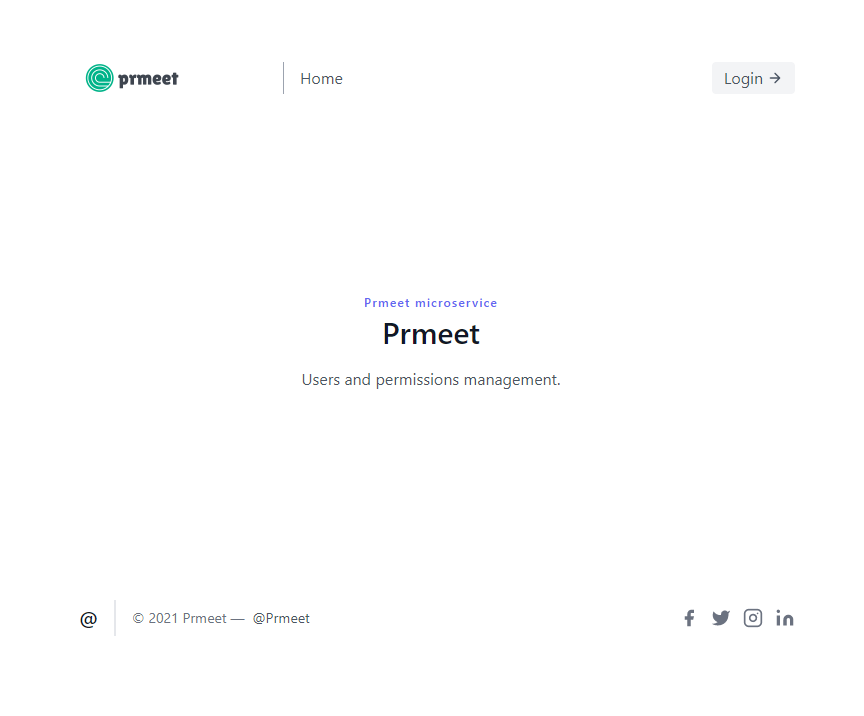

# prmeet



# This is a boilerplate for [nats-prmeet](https://github.com/oxks/nats-prmeet) microservice. 

## Intention. 

The library is intended to be a starting point for a project with a simple users/permissions microservice included and messaging using NATS. 

## Prerequisites: 

[Go](https://go.dev/doc/install), [Air](https://github.com/cosmtrek/air), [TailwindCSS](https://tailwindcss.com/docs/installation/using-postcss)

Edit internal/utils/my_utils/config.go with your data. 

## How to run: 

```bash
git clone

cd prmeet

air
```

## Usage:

Some prior understanding of Echo Framework, TailwindCSS, NATS is welcome. 
Edit your routes, add handlers and so on... Air will build on the fly. 